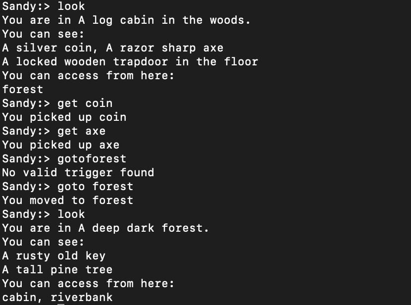

# text-adventure-game-engine

A text-based adventure game engine with multi-player support.


## Overview

This engine supports **text adventure games** with multiple players.  
- **Entities** (DOT format) define locations, paths, and objects.  
- **Actions** (XML format) define triggers, subjects, consumed/produced objects, and narration.  

The engine parses these files, maintains game state, and executes built-in player commands.


## Features

- Multi-player support via client-server model  
- Built-in commands: `inventory` / `inv`, `get`, `drop`, `goto`, `look`  
- Game state resets on server restart  
- Flexible command parsing (case-insensitive, partial matches)


## Play the Game

### Start Server

```bash
mvn exec:java@server
```

### Start Client
```bash
mvn exec:java@client -Dexec.args="playerName"
```

